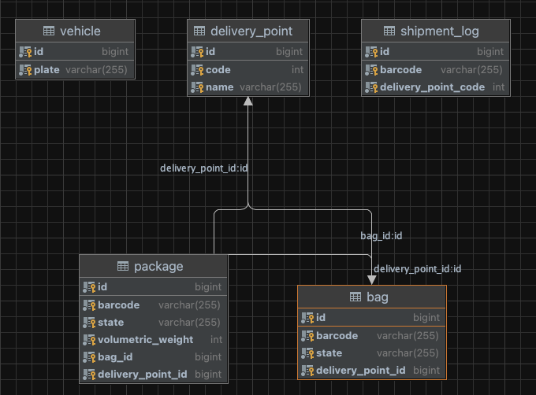

## Fleet Management Microservice Projects

### Project Goals
In this application, we want you to design a small-scale fleet management system where
vehicles make deliveries to predetermined locations along a certain route.

The system have two different shipment types which are Bag and Package.

The system has vehicle and then vehicle has a licence plate.

The system have three different delivery points. These are Branch, Distribution Center, and Transfer Center.

### Tech Stack
1. Java 11
2. Spring Boot Environments 2.7.1
3. Lombok
4. Resilience4J
5. Redis
6. Apache Kafka
7. Test Containers 1.17.3
8. Mockito 1.10.19
9. MySQL
10. SpringDoc 1.6.7
11. Docker

### Endpoints/Usages
**Vehicle**
1. POST /vehicle
<br/>for create vehicle

**DeliveryPoint**
1. POST /delivery-points
<br/>for create delivery point

**Bag**
1. POST /bags
<br/> for create bag

**Package**
1. POST /packages
<br/>for create package
2. PUT /packages
<br/>for update adding packages into bag


**Shipment**
1. POST /shipments
<br/>for distribute shipments

### Swagger Collection
http://localhost:8080/swagger-ui/index.html

### Run Projects
1. Docker :
    - Compile project with Java 11
    - Run with Docker comments , go to project folder and run this commands:

    ```
    $ docker-compose -f docker-compose.yml up -d
    ```
2. With IDE  :
    - Run all images without fleet-management image in docker-compose.yml file and run project

### Curl Command
- You can see curl command in http://localhost:8080/swagger-ui.html

### Database Schema and Tables

